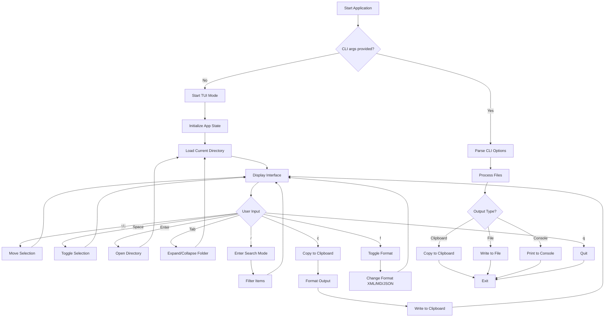

# Diagram of the project

## Execution flow

```mermaid
flowchart TD
    A["Start Application"] --> B{"CLI args provided?"}
    B -->|No| C["Start TUI Mode"]
    B -->|Yes| D["Parse CLI Options"]

    C --> E["Initialize App State"]
    E --> F["Load Current Directory"]
    F --> G["Display Interface"]
    
    G --> H{"User Input"}
    H -->|"↑/↓"| I["Move Selection"]
    H -->|"Space"| J["Toggle Selection"]
    H -->|"Enter"| K["Open Directory"]
    H -->|"Tab"| L["Expand/Collapse Folder"]
    H -->|"/"| M["Enter Search Mode"]
    H -->|"c"| N["Copy to Clipboard"]
    H -->|"f"| O["Toggle Format"]
    H -->|"q"| P["Quit"]
    
    I --> G
    J --> G
    K --> F
    L --> F
    M --> Q["Filter Items"]
    Q --> G
    N --> R["Format Output"]
    R --> S["Write to Clipboard"]
    S --> G
    O --> T["Change Format XML/MD/JSON"]
    T --> G
    
    D --> U["Process Files"]
    U --> V{"Output Type?"}
    V -->|"Clipboard"| W["Copy to Clipboard"]
    V -->|"File"| X["Write to File"]
    V -->|"Console"| Y["Print to Console"]
    
    W --> Z["Exit"]
    X --> Z
    Y --> Z
    P --> Z
```