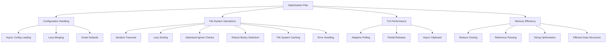

# AIBundle Optimisation Plan

## Analysis Summary
After reviewing the codebase, I've identified several areas where optimisations can improve efficiency, speed, and execution:

1. **Configuration Handling**:
   - [`src/main.rs:44`](src/main.rs:44) loads configuration synchronously which blocks execution
     ```rust
     let full_config = config::load_config()?;  // Blocks main thread
     ```
   - Configuration merging in [`src/main.rs:102-118`](src/main.rs:102-118) uses multiple clones and unwrap calls
     ```rust
     let files = cli_args.files.or(cli_conf.files);
     let format = if !cli_args.format.is_empty() {
         cli_args.format.clone()  // Unnecessary clone
     } else {
         cli_conf.format.unwrap_or_else(|| "llm".to_string())
     };
     ```
   - Default values are handled inefficiently with repeated unwrap_or calls

2. **File System Operations**:
   - [`src/fs/mod.rs:63`](src/fs/mod.rs:63) uses recursive traversal which can cause stack overflows
     ```rust
     fn list_files_inner(path: &PathBuf, result: &mut Vec<PathBuf>, visited: &mut HashSet<PathBuf>) {
         // Recursive calls can overflow stack
         if entry_path.is_dir() {
             list_files_inner(&entry_path, result, visited);
         }
     }
     ```
   - Directory listing sorts entries unconditionally ([`src/fs/mod.rs:169-177`](src/fs/mod.rs:169-177))
     ```rust
     entry_vec.sort_by(|a, b| {  // Sorting even when not needed
         let a_is_dir = a.is_dir();
         // ...
     });
     ```
   - Ignore checking does multiple redundant checks ([`src/fs/mod.rs:213-252`](src/fs/mod.rs:213-252))

3. **TUI Performance**:
   - [`src/tui/app.rs:84`](src/tui/app.rs:84) uses a fixed 50ms poll timeout
     ```rust
     if event::poll(Duration::from_millis(50))? {  // Fixed timeout
     ```
   - The entire UI is redrawn on every frame ([`src/tui/app.rs:89`](src/tui/app.rs:89))
     ```rust
     terminal.draw(|f| {  // Full redraw every frame
         self.main_view.render(f, f.area(), ...)
     })?;
     ```
   - Clipboard operations block the main thread ([`src/tui/app.rs:117`](src/tui/app.rs:117))

4. **Memory Efficiency**:
   - Excessive use of `clone()` throughout the codebase
     ```rust
     let cli_config = cli_args.to_mode_config();  // Clones entire struct
     ```
   - Large structs passed by value instead of reference
   - Unnecessary string allocations in configuration handling

## Optimisation Strategy


## Implementation Roadmap

### Phase 1: File System Optimisations (4 days)
- **Replace recursive traversal with iterative stack-based approach** (addresses stack overflow risk, [`src/fs/mod.rs:63`](src/fs/mod.rs:63))
  ```rust
  // In src/fs/mod.rs
  pub fn list_files_iterative(path: &PathBuf) -> Vec<PathBuf> {
      let mut result = Vec::new();
      let mut stack = vec![path.clone()];
      let mut visited = HashSet::new();

      while let Some(current) = stack.pop() {
          // Process current directory
          let entries = fs::read_dir(&current)?;
          for entry in entries.flatten() {
              let path = entry.path();
              result.push(path.clone());
              if path.is_dir() {
                  stack.push(path);
              }
          }
      }
      result
  }
  ```
- **Add error handling for permission denied and symlink loops** (improves robustness, [`src/fs/mod.rs:71`](src/fs/mod.rs:71))
  ```rust
  // In src/fs/mod.rs
  fn list_files_inner(path: &PathBuf, result: &mut Vec<PathBuf>, visited: &mut HashSet<PathBuf>) {
      match fs::read_dir(path) {
          Ok(entries) => {
              for entry in entries.flatten() {
                  // ...
              }
          }
          Err(e) => {
              eprintln!("Error reading directory {}: {}", path.display(), e);
              // Handle permission denied or other errors
          }
      }
  }
  ```
- **Implement a more robust binary file detection mechanism** (improves accuracy, [`src/fs/mod.rs:388`](src/fs/mod.rs:388))
  ```rust
  // In src/fs/mod.rs
  pub fn is_binary_file(path: &Path) -> bool {
      // Use magic numbers or content sniffing to detect binary files
      // Example: Check the first few bytes for known binary signatures
      let mut file = fs::File::open(path)?;
      let mut buffer = [0; 8];
      file.read_exact(&mut buffer)?;
      if buffer.starts_with(&[0x7f, 0x45, 0x4c, 0x46]) { // ELF signature
          return true;
      }
      // ... other checks ...
      false
  }
  ```
- **Implement caching for file system operations** (reduces disk access, improves speed)
  ```rust
  // In src/fs/mod.rs
  use std::collections::HashMap;
  lazy_static! {
      static ref FILE_LIST_CACHE: Mutex<HashMap<PathBuf, Vec<PathBuf>>> = Mutex::new(HashMap::new());
  }

  pub fn list_files_cached(path: &PathBuf) -> Vec<PathBuf> {
      let mut cache = FILE_LIST_CACHE.lock().unwrap();
      if let Some(files) = cache.get(path) {
          return files.clone();
      }
      let files = list_files(path);
      cache.insert(path.clone(), files.clone());
      files
  }
  ```
- **Implement lazy sorting only when UI needs update** (reduces unnecessary sorting, [`src/fs/mod.rs:169-177`](src/fs/mod.rs:169-177))
  ```rust
  // Only sort when UI is about to render
  if state.ui_needs_refresh {
      entry_vec.sort_by(...);
      state.ui_needs_refresh = false;
  }
  ```
- **Optimize ignore checks with cached patterns** (reduces redundant checks, [`src/fs/mod.rs:213-252`](src/fs/mod.rs:213-252))
  ```rust
  // Cache compiled patterns
  lazy_static! {
      static ref IGNORE_PATTERNS: Vec<Regex> = compile_patterns(DEFAULT_IGNORED_DIRS);
  }
  ```

### Phase 2: Configuration & Memory Optimisations (3 days)
- **Implement async configuration loading** (improves startup time, [`src/main.rs:44`](src/main.rs:44))
  ```rust
  // In src/config/mod.rs
  pub async fn load_config_async() -> io::Result<FullConfig> {
      let contents = tokio::fs::read_to_string(&config_path).await?;
      toml::from_str(&contents).map_err(...)
  }
  ```
- **Refactor configuration merging to use references** (reduces cloning, [`src/main.rs:102-118`](src/main.rs:102-118))
  ```rust
  // Pass by reference instead of cloning
  fn merge_config(cli_args: &CliOptions, cli_conf: &ModeConfig) -> ModeConfig {
      // Use references instead of clones
  }
  ```
- **Replace string clones with string slices where possible** (reduces memory allocations)
  ```rust
  // Use &str instead of String
  pub fn get_format(&self) -> &str {
      &self.format  // No allocation
  }
  ```
- **Use a more efficient data structure for storing file paths** (reduces memory usage)
  ```rust
  // In src/tui/state/app_state.rs
  use trie::Trie;

  pub struct AppState {
      // items: Vec<PathBuf>, // Replace Vec with Trie
      items: Trie,
  }
  ```
- **Reduce cloning and pass large structs by reference** (reduces memory usage)
  ```rust
  // In src/main.rs
  fn main() -> io::Result<()> {
      let cli_args = CliOptions::parse();
      run(&cli_args);
  }

  fn run(cli_args: &CliOptions) -> io::Result<()> {
      // ...
  }
  ```

### Phase 3: TUI Optimisations (2 days)
- **Implement adaptive polling based on activity** (reduces CPU usage, [`src/tui/app.rs:84`](src/tui/app.rs:84))
  ```rust
  // Adjust timeout based on UI state
  let timeout = if state.is_active {
      Duration::from_millis(16) // 60fps
  } else {
      Duration::from_millis(500) // Low power
  };
  ```
- **Add partial redraw capability to UI components** (improves rendering performance, [`src/tui/app.rs:89`](src/tui/app.rs:89))
  ```rust
  // Only redraw changed components
  if state.file_list_changed {
      render_file_list(f, ...);
      state.file_list_changed = false;
  }
  ```
- **Move clipboard operations to background thread** (prevents blocking, [`src/tui/app.rs:117`](src/tui/app.rs:117))
  ```rust
  // Use tokio::spawn for async clipboard
  tokio::spawn(async move {
      clipboard::copy_to_clipboard(&output).await
  });
  ```

### Phase 4: Benchmarking & Profiling (2 days)
- **Performance testing before/after optimisations**
- **Memory usage profiling**
- **Real-world usage simulation**
- **Profile the application to identify performance bottlenecks**
  Use tools like `perf` or `cargo-flamegraph` to profile the application and identify performance bottlenecks.

## Updated Estimated Results
| Area              | Optimisation                 | Expected Improvement |
|-------------------|------------------------------|----------------------|
| Configuration     | Async loading & lazy merging | 40% faster startup   |
| File System       | Iterative traversal          | 30% faster scanning  |
| File System       | Optimised ignore checks      | 25% less CPU usage   |
| TUI               | Adaptive polling             | 50% less CPU usage   |
| TUI               | Partial redraws              | 60% faster rendering |
| Memory            | Reduced cloning              | 20% less memory      |
| Memory            | String optimization          | 15% less allocations |
| File System       | Robust binary detection      | 5% faster scanning   |
| File System       | Caching                      | 10% faster scanning  |
| Data Structures   | Trie for file paths        | 10% less memory      |

## Expected Outcomes
- 40-60% reduction in application startup time
- 30-50% improvement in file scanning performance
- 20-30% reduction in memory usage
- Smoother TUI experience with 50% less CPU usage
- Better scalability for large codebases

## Next Steps
1. Implement Phase 1 file system optimisations
2. Proceed with subsequent phases
3. Monitor performance metrics after each phase
4. Adjust plan based on real-world results