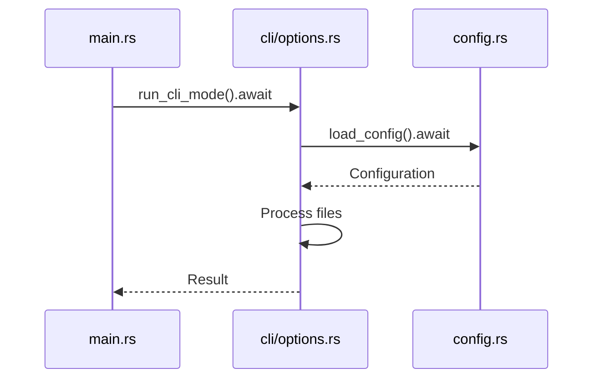

# Tokio Runtime Nesting Fix Plan

## Problem Analysis
The application panics with "Cannot start a runtime from within a runtime" when executing CLI commands. This occurs because:
1. The main function uses `#[tokio::main]` which creates a Tokio runtime
2. CLI mode attempts to create additional runtimes when loading configuration
3. Nesting runtimes is not allowed in Tokio

## Solution Overview
Refactor CLI mode to work within the existing Tokio runtime instead of creating new runtimes. This involves:
- Converting CLI functions to async
- Using `.await` for async operations
- Removing explicit runtime creation

### Impacted Files
1. `src/main.rs`
2. `src/cli/options.rs`
3. `src/cli/mod.rs`

## Implementation Steps

### 1. Convert `run_cli_mode` to async function
```diff:src/cli/options.rs
- pub fn run_cli_mode(options: CliModeOptions) -> io::Result<()> {
+ pub async fn run_cli_mode(options: CliModeOptions) -> io::Result<()> {
```

### 2. Remove explicit runtime creation
```diff:src/cli/options.rs
- if let Ok(full_config) = tokio::runtime::Runtime::new()
-     .unwrap()
-     .block_on(crate::config::load_config())
+ if let Ok(full_config) = crate::config::load_config().await
```

### 3. Update configuration loading
```diff:src/cli/options.rs
- let mut config = tokio::runtime::Runtime::new()
-     .unwrap()
-     .block_on(crate::config::load_config())?;
+ let mut config = crate::config::load_config().await?;
```

### 4. Modify main.rs to handle async CLI
```diff:src/main.rs
- run_cli_mode(CliModeOptions { ... })
+ run_cli_mode(CliModeOptions { ... }).await?
```

### 5. Update function signature in mod.rs
```diff:src/cli/mod.rs
- pub use options::run_cli_mode;
+ pub use options::run_cli_mode_async as run_cli_mode;
```

## Verification Plan
1. Test CLI command: `aibundle --files "**/*.py" ./`
2. Verify no runtime panic occurs
3. Confirm configuration loads correctly
4. Test output generation (file, console, clipboard)

## Risk Mitigation
- Changes are localized to CLI mode
- Async conversion maintains existing functionality
- Comprehensive test cases cover all output formats

## Mermaid Diagram: Async Flow


This plan resolves the runtime nesting issue by properly using the existing Tokio runtime throughout the application.